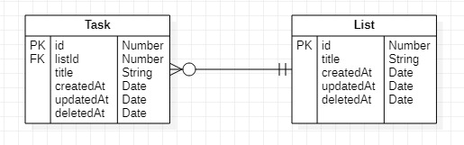

# `SERVIÇO TO-DO`

##### Disponível em: [GitHub](https://github.com/Dariellysantos/to-do-service)

##### Foi desenvolvido por [Darielly Santos](https://www.linkedin.com/in/darielly-santos/)

  

Esse projeto foi desenvolvido para o processo seletivo da _Alicerce Educação_.

O objetivo era desenvolver um serviço de API Rest com crud para as entidades _task_ e _list_ relacionaddas conforme abaixo:

 

## Pré requisitos

 

- NodeJs - v10.19.0 - acesse o site oficial para mais informações: https://nodejs.org/en/
- Npm - 6.14.4 - acesse o site oficial para mais informações: https://www.npmjs.com/
- MySql - acesse o site oficial para mais informações: https://www.mysql.com/

 

## Criar tabela no banco

 

Para exucutar o proeto é necessario ter instalado o MySql para a persistência dos dados.

- Para criar as tabelas iniciais :

  - Acesse o MySql e crie uma tabela chamada db_todo

  - Crie um usuário e dê permissão de leitura e escrita no banco db_todo

  - Altere as informações do arquivo dbServer.js no pasta /config, incluindo as suas credenciais de usuário no banco

  - Acesse a raiz do projeto e execute o comando

    `node /config/dbCreate.js`

 

## Executar projeto

 

Com a tabela criada e pré requisitos instalados, execute o comando abaixo para instalar as dependências do projeto:

`npm install`

Após finalizar as instalações, execute o comando abaixo para iniciar o projeto:

`npm start`

Verifique se a menssagem `Serviço toDo ativo.` aparece no terminal, indicando que o serviço iniciou corretamente.

O endereço de acesso local é: `http://localhost:3000`.

 

## Conhecimentos adquiridos

 

- Estruturar um projeto MVC

- Usar o Orm Sequelize

- Foreign key

- Padrão URL

- Tratamento de erros

- Algumas boas práticas de programação

 

## Referências utilizadas para estudo

 

- https://www.brunobrito.net.br/api-restful-boas-praticas/

- https://www.devmedia.com.br/primeiros-passos-no-mysql/28438

- https://www.ti-enxame.com/pt/mysql/mysql-criar-tabela-com-varias-chaves-estrangeiras-no-conjunto-de-exclusao-nulo/1072108198/

- http://devfuria.com.br/sql/mysql-criando-tabelas/

- https://evertpot.com/executing-a-mysql-query-in-nodejs/

- https://www.youtube.com/watch?v=g5ij7NIPR2s

- https://www.luiztools.com.br/post/tutorial-de-crud-com-node-js-sequelize-e-mysql-2/

- https://www.youtube.com/watch?v=4ktEr1rbhx8

- https://medium.com/italo-gouveia/criando-minha-primeira-api-rest-com-node-js-express-sequelize-e-mysql-para-cadastro-de-usu%C3%A1rios-1131a3e44ba1

- https://www.luiztools.com.br/post/autenticacao-em-node-js-com-passport/

- https://www.alura.com.br/conteudo/orm-nodejs-avancando-sequelize

- https://stackoverflow.com/questions/54687518/how-to-use-paranoid-in-sequelize

- https://www.bezkoder.com/node-js-express-sequelize-mysql/#Update_an_object

- https://sequelize.org/v3/docs/models-definition/

- https://docs.pipz.com/central-de-ajuda/learning-center/guia-basico-de-markdown#open
